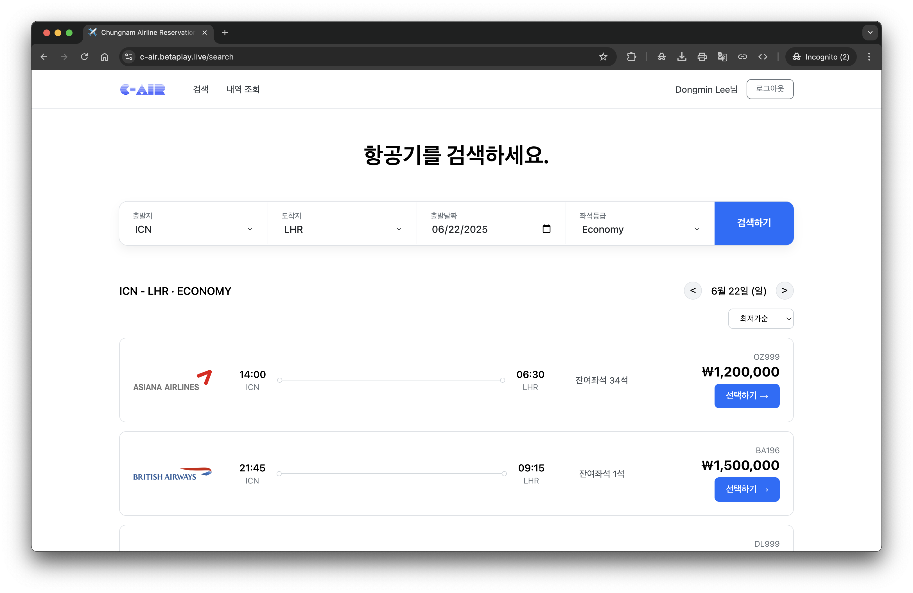
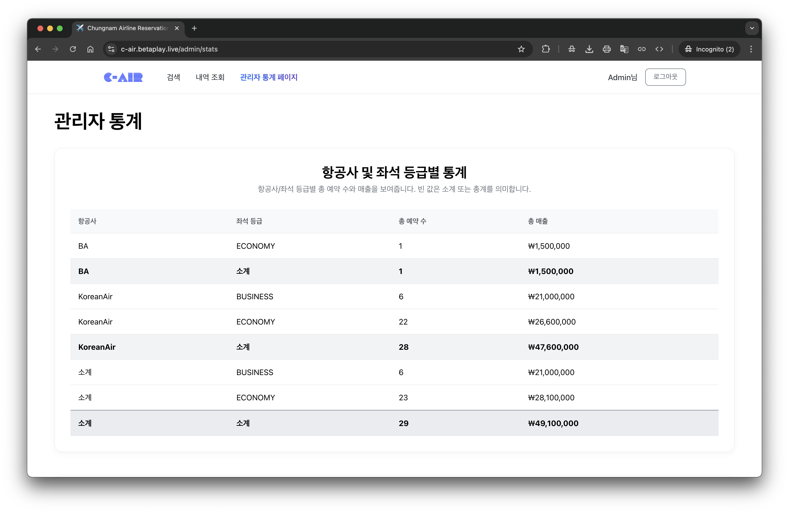

# C-Air

## Overview

C-Air is a database term project developed during my junior year at Chungnam National University. It serves as a simple airline reservation management system, utilizing fundamental SQL operations to manage bookings, cancellations, and customer information efficiently.

## Features

- Login page for user authentication (registration and search for password are not implemented)  
   

- Flight search functionality  
   

- Booking confirmation page  
   

- Booking cancellation page  
   

- Booking / Cancellation history page  
   

- Admin page for viewing system statistics  
   

## Installation

1. Clone the repository:

   ```bash
   git clone https://github.com/dongmin-dev/c-air.git
   ```

2. Navigate to the project directory:

   ```bash
   cd c-air
   ```

   a. For frontend:

   ```bash
   cd frontend
   npm install
   npm run build
   serve -s build
   ```

   b. For backend:

   ```bash
   cd backend
   npm install
   npm run dev
   ```

## Demo

You can view a live demo of the project at [c-air.betaplay.live](https://c-air.betaplay.live/)

## Contributing

Contributions are welcome! Please follow these steps:

1. Fork the repository.
2. Create a new branch for your feature or bug fix.
3. Submit a pull request.

## License

This project is licensed under the MIT. See the `LICENSE` file for details.

## Contact

For questions or feedback, please contact [yeet@o.cnu.ac.kr](mailto:yeet@o.cnu.ac.kr)
